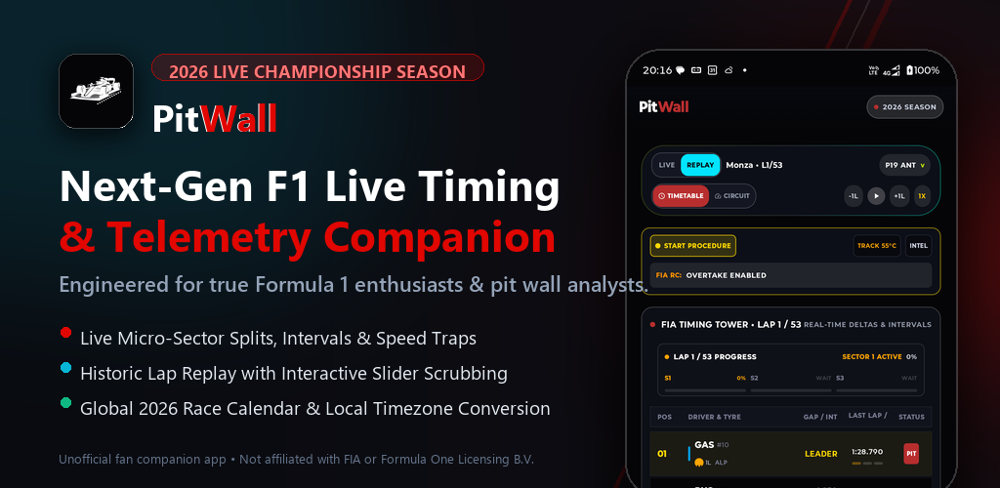
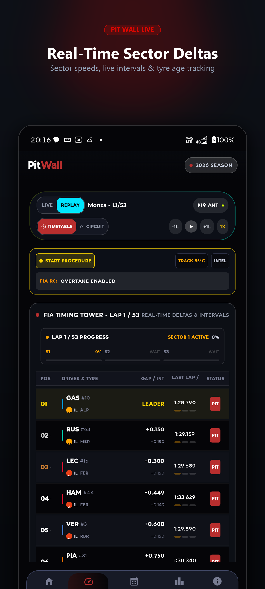
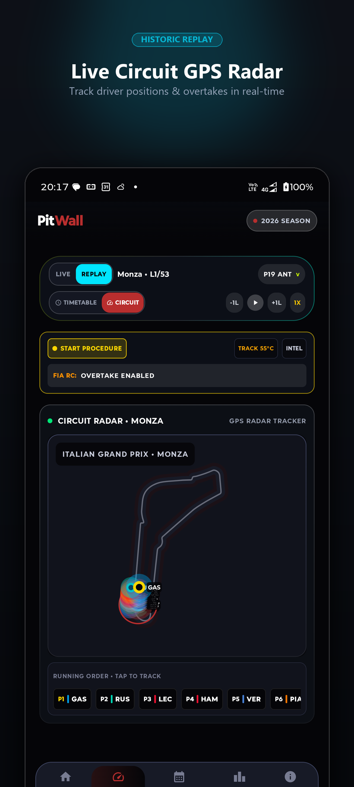
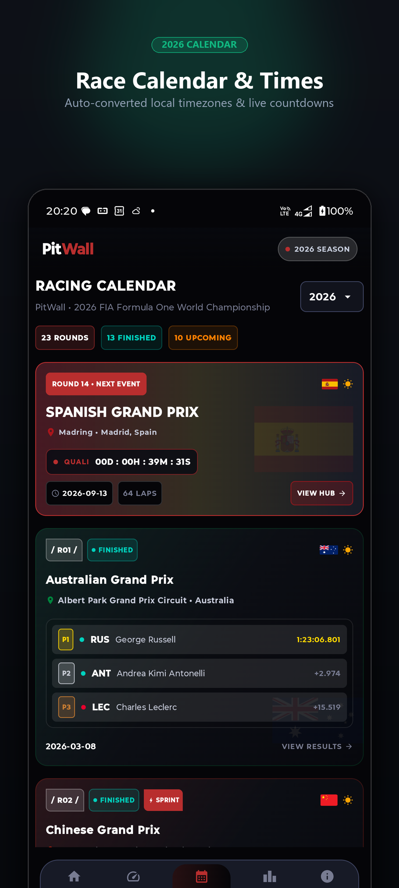
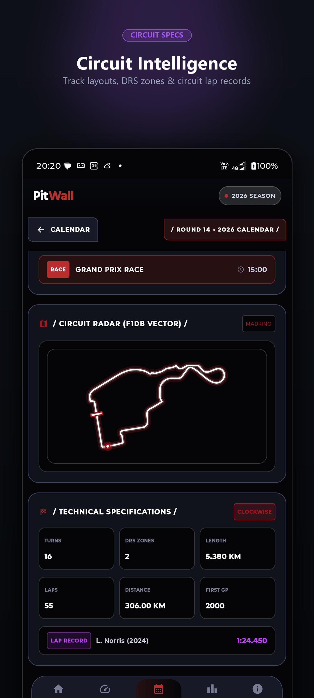
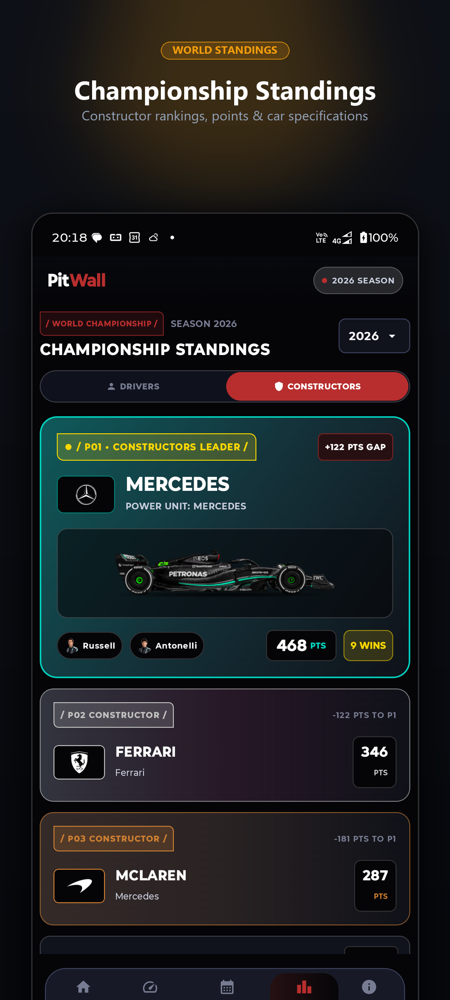
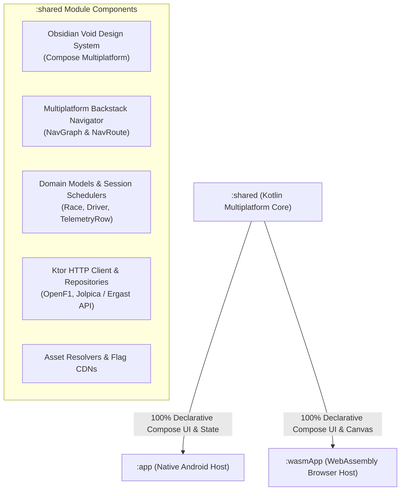

# PitWall: F1 Timing & Telemetry

<div align="center">



[](https://kotlinlang.org/)
[](https://www.jetbrains.com/lp/compose-multiplatform/)
[](https://webassembly.org/)
[](https://developer.android.com/)
[](https://f1.dirzaaulia.com)
[](https://play.google.com/store/apps/details?id=com.dirzaaulia.formula1)
[](https://f1.dirzaaulia.com/privacy)

**Next-generation live timing, session replay telemetry, sector speed analysis, and race calendar companion for Formula 1 fans.**

[🌐 Launch WebApp (WASM)](https://f1.dirzaaulia.com) &bull; [🔒 Privacy Policy](https://f1.dirzaaulia.com/privacy) &bull; [📱 Android App](#-getting-started)

</div>

---

## 🏎️ Overview

**PitWall** is an ultra-fast, responsive motorsport companion engineered with **Kotlin Multiplatform (KMP)** and **Compose Multiplatform (CMP)**. It delivers the thrill of being in the team control garage directly to your screen—sharing a unified, 100% declarative Compose UI across **Android** and high-performance **WebAssembly (WASM)**.

### ✨ Key Features

* **⏱️ Real-Time Live Timing & Pit Wall Telemetry:**  
  Track driver positions, intervals to the car ahead, and delta to leader. Micro-sector split times with purple (fastest overall), green (personal best), and yellow timing indicators.
* **🏎️ Historic Session Replay Hub:**  
  Scrub and rewind through every lap of Grand Prix sessions with interactive replay controls. Compare sector speeds, top speed traps, and tyre deg between championship rivals.
* **🛞 Live Tyre Stints & Circuit Weather Radar:**  
  Monitor active tyre compounds (Soft, Medium, Hard, Intermediate, Wet), stint age in laps, pit stop durations, track temperature, air temp, and rain probability.
* **🚩 Instant Race Control Messages:**  
  Real-time Safety Car (SC, VSC), yellow/red flags, track limit warnings, and steward investigation updates displayed in full without truncation.
* **📅 2026 Race Calendar & Circuit Analytics:**  
  Start times automatically converted to your local timezone. Live weekend countdown timers, track record specifications, and circuit layout schematics.
* **🏆 World Championship Standings:**  
  Driver and constructor championship standings with authentic team liveries and real-time points progression.
* **🔒 100% Privacy-First:**  
  Zero account required, zero advertising trackers, and zero personal data collection.

---

## 📸 Application Showcase & Play Store Gallery

<div align="center">

| ⏱️ Real-Time Sector Deltas | 🛰️ Circuit GPS Radar & Replay | 📅 2026 Race Calendar |
| :---: | :---: | :---: |
| <a href="screenshots/store_listing/01_telemetry_banner.png"></a> | <a href="screenshots/store_listing/02_circuit_banner.png"></a> | <a href="screenshots/store_listing/03_calendar_banner.png"></a> |
| *Live micro-sector splits & intervals* | *Driver track positioning & replay* | *Local timezone converted schedules* |

<br/>

| 🏁 Circuit Intelligence & Specs | 🏆 Championship Standings |
| :---: | :---: |
| <a href="screenshots/store_listing/04_specs_banner.png"></a> | <a href="screenshots/store_listing/05_standings_banner.png"></a> |
| *Track layouts, DRS zones & records* | *Constructor points & driver rankings* |

</div>

---

## 🏗️ Architecture & Modularization

The project is structured as a modern Kotlin Multiplatform monorepo adhering to clean architecture and unidirectional data flow (MVI/MVVM):



### Module Breakdown

| Module | Target | Responsibilities |
| :--- | :--- | :--- |
| **`:shared`** | Multiplatform (`commonMain`, `androidMain`, `wasmJsMain`) | Unified Compose Multiplatform UI, Obsidian Void theme tokens, navigation backstack, domain models, Ktor HTTP networking, telemetry physics, and media asset resolvers. |
| **`:app`** | Android Native (SDK 36, minSdk 29) | Android application host, edge-to-edge system bars, Hilt dependency injection, Splash Screen API, Chucker network inspection, and Play Store packaging. |
| **`:wasmApp`** | Kotlin/Wasm (`wasmJs`) | Browser entry point rendering Compose Multiplatform onto HTML5 Canvas via Skiko at 60 FPS, hosted on Firebase Hosting edge CDN. |
| **`scripts/`** | Python Automation | Automated Google Play Console deployment, metadata translation sync, device screenshot capture, and app icon generator. |
| **`docs/`** | Documentation & Assets | Architecture documentation, Play Store ASO guides, and hi-res publishing graphics. |

---

## 🛠️ Tech Stack & Dependencies

| Layer | Technology | Details |
| :--- | :--- | :--- |
| **Language** | [Kotlin](https://kotlinlang.org/) | `2.1.21` (Multiplatform) |
| **UI Framework** | [Compose Multiplatform](https://www.jetbrains.com/lp/compose-multiplatform/) | `1.8.2` (BOM `2025.05.00`) |
| **Web Engine** | Kotlin/Wasm + [Skiko](https://github.com/JetBrains/skiko) | Direct WebAssembly canvas rendering |
| **Networking** | [Ktor Client](https://ktor.io/) | `3.1.3` (OkHttp engine on Android, Js/Browser on Wasm) |
| **Serialization** | [kotlinx.serialization](https://github.com/Kotlin/kotlinx.serialization) | `1.8.1` (JSON) |
| **Image Loading** | [Coil 3 Multiplatform](https://coil-kt.github.io/coil/) | `3.2.0` (SVG decoding + OkHttp/Fetch cache) |
| **Date & Time** | [kotlinx-datetime](https://github.com/Kotlin/kotlinx-datetime) | `0.6.2` + Local timezone converter |
| **Design System** | Custom Obsidian Void | `#060709` deep black, `#E10600` racing red, Outfit & JetBrains Mono typography |
| **Android Host DI** | [Dagger Hilt](https://dagger.dev/hilt/) | `2.56.2` (Android host injection) |
| **Hosting & CDN** | [Firebase Hosting](https://firebase.google.com/docs/hosting) | HTTP/2 edge deployment for WASM distribution |
| **Automation** | Python & Google Publisher API | Direct Play Store REST automation (`scripts/deploy_playstore.py`) |

---

## 📂 Directory Structure

```
FormulaTrackr/
├── app/                                 # Android host module
│   ├── src/main/java/com/dirzaaulia/    # MainActivity, Hilt DI modules, Android host glue
│   └── src/main/res/                    # App launcher icons, strings, theme XMLs
│
├── shared/                              # Core Kotlin Multiplatform module
│   ├── src/commonMain/kotlin/           # 100% Shared UI, screens, domain models, Ktor APIs
│   │   ├── model/                       # Race, Driver, TelemetryRow, Team, Circuit models
│   │   ├── navigation/                  # NavRoute, NavGraph multiplatform backstack
│   │   ├── network/                     # OpenF1Service, JolpicaService, NetworkRepository
│   │   ├── theme/                       # Color, Theme, Obsidian Void styling tokens
│   │   ├── ui/                          # Screens (Home, Telemetry, Calendar, Standings, etc.)
│   │   └── util/                        # Telemetry physics, date formatting, CDNs
│   ├── src/androidMain/kotlin/          # Android platform-specific implementations
│   └── src/wasmJsMain/kotlin/           # WASM platform-specific implementations
│
├── wasmApp/                             # WebAssembly web application module
│   ├── src/wasmJsMain/kotlin/           # Main.kt entrypoint
│   └── src/wasmJsMain/resources/        # index.html, privacy.html
│
├── docs/                                # Store graphics, icons & ASO guides
│   ├── PLAYSTORE_ASO_GUIDE.md
│   ├── playstore_icon_512.png
│   └── feature_graphic_1024x500.png
│
├── screenshots/                         # Store marketing banners & raw captures
│   ├── store_listing/                   # High-res framed store banners (1080x2400)
│   └── raw/                             # Clean full-fidelity device captures
│
├── scripts/                             # Python deployment & asset tooling
│   ├── deploy_playstore.py              # Automated Play Console AAB build & deploy
│   ├── upload_play_store_assets.py      # Automated listing, icon & screenshot sync
│   ├── generate_app_icons.py            # Android mipmap icon generator
│   └── generate_store_screenshots.py    # Multi-language framed store screenshots
│
├── firebase.json                        # Firebase Hosting routing & caching headers
└── build.gradle.kts                     # Root build configuration with version catalogs
```

---

## 🚀 Getting Started

### Prerequisites

* **JDK 17** or newer
* **Android SDK** (API Level 36, build-tools 36.0.0)
* **Node.js** (Optional, for running local webpack dev server)
* **Python 3.10+** (For automated store deployment scripts)

### Building & Running

#### 1. Android Application
Connect your Android phone or start an emulator, then execute:
```bash
# Debug build and install
./gradlew :app:installDebug

# Release Android App Bundle (.aab)
./gradlew :app:bundleRelease
```

#### 2. WebAssembly (WASM) Web Application
```bash
# Run local dev server with hot reload
./gradlew :wasmApp:wasmJsBrowserDevelopmentRun

# Build production WASM distribution bundle
./gradlew :wasmApp:wasmJsBrowserDistribution
```
The optimized web distribution will be emitted to:  
`wasmApp/build/dist/wasmJs/productionExecutable/`

#### 3. Running Unit Tests
```bash
./gradlew testDebugUnitTest
```

---

## 🚢 Deployment Workflow

### Web (Firebase Hosting)
PitWall Web is deployed to Firebase Hosting (`pitwall-508002`) accessible via [f1.dirzaaulia.com](https://f1.dirzaaulia.com):
```bash
# 1. Compile WASM distribution bundle
./gradlew :wasmApp:wasmJsBrowserDistribution

# 2. Deploy hosting targets
firebase deploy --only hosting
```

### Android (Google Play Console)
PitWall includes zero-friction direct API deployment scripts with automatic version bumping and multilingual listing sync:
```bash
# Build AAB and submit directly to Play Store production review
python scripts/deploy_playstore.py --track production --build

# Update store listings, 512px icon, feature graphic & framed screenshots
python scripts/upload_play_store_assets.py
```

---

## ⚖️ Legal Disclaimer

**PitWall** is an independent, unofficial fan companion application built under nominative fair use. It is not affiliated, associated, authorized, endorsed by, or in any way officially connected with Formula One Licensing B.V., Formula One Management, Formula One World Championship Limited, the FIA, or any Formula 1 constructor or team.

F1, FORMULA ONE, FORMULA 1, FIA FORMULA ONE WORLD CHAMPIONSHIP, GRAND PRIX, and related trademarks are registered properties of Formula One Licensing B.V. All team and driver identifiers are used strictly for descriptive fan identification purposes under fair use.

---

## 📄 License

```
Copyright 2026 Dirza Aulia

Licensed under the Apache License, Version 2.0 (the "License");
you may not use this file except in compliance with the License.
You may obtain a copy of the License at

    http://www.apache.org/licenses/LICENSE-2.0
```
